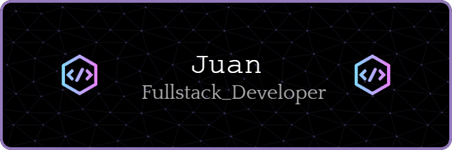

### Hi there 👋

<!--
**jvill171/jvill171** is a ✨ _special_ ✨ repository because its `README.md` (this file) appears on your GitHub profile.

Here are some ideas to get you started:

- 🔭 I’m currently working on ...
- 🌱 I’m currently learning ...
- 👯 I’m looking to collaborate on ...
- 🤔 I’m looking for help with ...
- 💬 Ask me about ...
- 📫 How to reach me: ...
- 😄 Pronouns: ...
- ⚡ Fun fact: ...
-->

    

 
 

    <!-- HTML5 -->
    
    
    <!-- CSS3 -->
    
    
    <!-- jQuery -->
    
    <!-- Markdown -->
    
    
    <!-- Python -->
    
    <!-- Flask -->
    
    
    <!-- Javascript -->
    
    <!-- NodeJS -->
    
    
    <!-- React -->
    
    <!-- VueJS -->
    
    <!-- Sass -->
    
    <!-- Bootstrap -->
    
    <!-- Tailwind -->
    
    <!-- PostgreSQL -->
    
    
    <!-- VS Code -->
    

 
 

  

<!-- GH Dark Mode backgrounds:
        background-color: rgb(34, 39, 46);
        background-color: rgb(13, 17, 23);
        
    Leaving this here to reference background colors with SVGs if I add more later-->